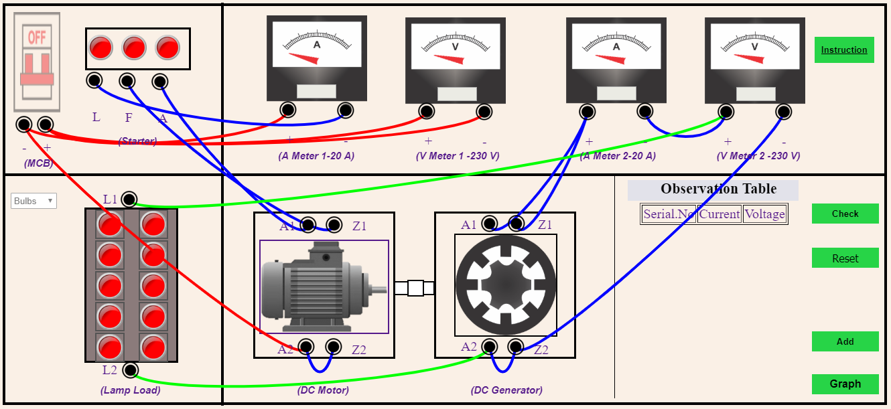

Step 1: Make all the Correct Connections.   
 1. Positive Terminal of MCB - Positive Terminal of A Meter-1.  
 2. Positive Terminal of MCB - Positive Termainal of V Meter-2. 
 3. Negative Terminal of MCB - Negative Terminal of V Meter-1.  
 4. Negative Terminal of MCB - A2 of Motor. 
 5. A2 - F2. 
 6. L - Negative Termianl of A Meter-1.  
 7. F - Z1. 
 8. A - A1. 
 9. L2 - A2 of Generator. 
 10. A2 of Generator - F2 of Generator. 
 11. F2 of Generator - Negative Termianl of V Meter-2.  
 12. Negative Terminal of A Meter-2 - Positive Terminal of V Meter-2.  
 13. L1 - Positive Terminal of V Meter-2.  
 14. Positive Terminal of A Meter-2 - A1 of Generator.  
 15. Positive Terminal of A Meter-2 - Z1 of Generator.  
  
Step 2: Click on "Check" Button. 
Step 3: After Correct Connections the Circuit will be turned ON. 
Step 4: Select the No. of "Bulbs" from the Lamp load. 
Step 5: Note Down the readings of the Ammeters & Voltmeters. 
Step 6: Click "Add" Button to Add the values to the Observation Table. 
Step 7: Add different values to the Table. 
Step 8: Click on "Graph" Button to Create Graph. 

