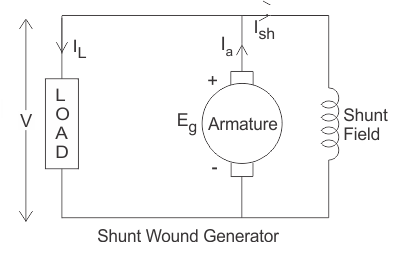
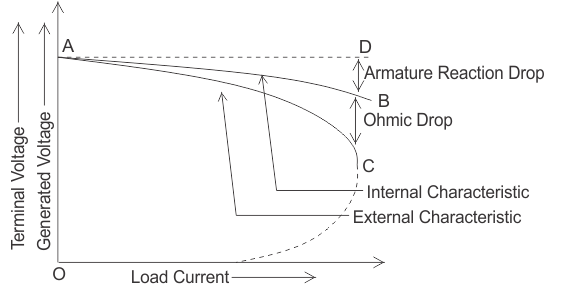

### Introduction
In a shunt generator, the field winding is connected in parallel with the armature winding so that terminal voltage of the generator is applied across it.
The shunt field winding has many turns of fine wire having high resistance. Therefore, only a part of armature current flows through shunt field winding and the rest flows through the load. Figure shows the connections of a shunt wound generator. The armature current Ia splits up into two parts- a small fraction Ish flowing through shunt field winding while the major part IL goes to the external load.  
                        

 
                        
<b>Fig. 1 Equivalent circuit of DC shunt generator for load characteristics</b>

                        

### Internal characteristic            
The internal characteristic curve represents the relation between the generated voltage Eg and the load current IL. When the generator is loaded then the generated voltage is decreased due to armature reaction. So, generated voltage will be lower than the emf generated at no load. Here in the figure below AD curve is showing the no load voltage curve and AB is the internal characteristic curve. 

### External or Load characteristic                        
AC curve is showing the external characteristic of the shunt wound DC generators. It is showing the variation of terminal voltage with the load current. Ohmic drop due to armature resistance gives lesser terminal voltage the generated voltage. That is why the curve lies below the internal characteristic curve. 

$V = (E_g - I_aR_a) = E_g - (I_L + I_{sh})R_a$

                        
The terminal voltage can always be maintained constant by adjusting the load terminal. External characteristics of shunt dc generator When the load resistance of a shunt-wound DC generator is decreased, then load current of the generator increased as shown in above figure. But the load current can be increased to a certain limit with (up to point C) the decrease of load resistance. Beyond this point, it shows a reversal in the characteristic. Any decrease of load resistance results in current reduction and consequently, the external characteristic curve turns back as shown in the dotted line, and ultimately the terminal voltage becomes zero. Though there is some voltage due to residual magnetism. We know, Terminal voltage Now, when IL increased, then terminal voltage decreased. After a certain limit, due to heavy load current and increased ohmic drop, the terminal voltage is reduced drastically. This drastic reduction of terminal voltage across the load results the drop in the load current although at that time load is high or load resistance is low. That is why the load resistance of the machine must be maintained properly. The point in which the machine gives maximum current output is called breakdown point (point C in the figure). 

 

<b>Fig. 2 Load characteristics of DC shunt generator</b>
 
Note - It may be seen from the external characteristic that change in terminal voltage from no-load to full load is small. The terminal voltage can always be maintained constant by adjusting the field rheostat R automatically.
  