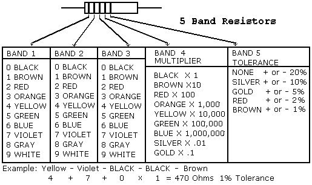

### 1) Resistor:  
Resistance can be defined as the opposition to current caused by a resistor. 
The resistance R in ohms (Ω) is equal to the voltage V in volts (V) divided by the current I in amps (A) :
  
<b> R = V /I </b>
</b>

   
 

<b>Figure : Resistor color guide </b>

### 2) Capacitor:
 A capacitor (originally known as a condenser) is a passive two-terminal electrical component used to store energy electrostatically in an electric field. The forms of practical capacitors vary widely, but all contain at least two electrical conductors (plates) separated by a dielectric (i.e., insulator). The conductors can be thin films of metal, aluminum foil or disks, etc. The 'nonconducting' dielectric acts to increase the capacitor's charge capacity. A dielectric can be glass, ceramic, plastic film, air, paper, mica, etc. Capacitors are widely used as parts of electrical circuits in many common electrical devices. Unlike a resistor, a capacitor does not dissipate energy. Instead, a capacitor stores energy in the form of an electrostatic field between its plates. 
 An ideal capacitor is characterized by a constant capacitance C, in farads in the SI system of units, defined as the ratio of the positive or negative charge Q on each conductor to the voltage V between them: 
 
<b> C = Q/V </b>

### 3) Inductor:
An Inductor, also called a choke, is another passive type electrical component consisting of a coil of wire designed to take advantage of this relationship by inducing a magnetic field in itself or within its core as a result of the current flowing through the wire coil. Forming a wire coil into an inductor result in a much stronger magnetic field than one that would be produced by a simple coil of wire. Inductors are formed with wire tightly wrapped around a solid central core which can be either a straight cylindrical rod or a continuous loop or ring to concentrate their magnetic flux. The schematic symbol for an inductor is that of a coil of wire so therefore, a coil of wire can also be called an Inductor.

### 4) Rheostat:
Rheostat,  adjustable resistor is used in applications that require the adjustment of current or the varying of resistance in an electric circuit. The rheostat can adjust generator characteristics, dim lights, and start or control the speed of motors. Its resistance element can be a metal wire or ribbon, carbon, or a conducting liquid, depending on the application. For average currents, the metallic type is most common; for very small currents, the carbon type is used; and for large currents, the electrolytic type, in which electrodes are placed in a conducting fluid, is most suitable.

### 5)Voltmeter:
A voltmeter, also known as a voltage meter, is an instrument used for measuring the potential difference, or voltage, between two points in an electrical or electronic circuit. Some voltmeters are intended for use in direct current (DC) circuits; others are designed for alternating current (AC) circuits. A basic analog voltmeter consists of a sensitive galvanometer (current meter) in series with high resistance. The internal resistance of a voltmeter must be high. Otherwise, it will draw significant current, and thereby disturb the operation of the circuit under test. The sensitivity of the galvanometer and the value of the series resistance determine the range of voltages that the meter can display.

### 6) Ammeter:
The meter uses for measuring the current is known as the ammeter. The current is the flow of electrons whose unit is ampere. Hence the instrument which measures the flows of current in ampere is known as ampere meter or ammeter. The ideal ammeter has zero internal resistance. But practically the ammeter has small internal resistance. The measuring range of the ammeter depends on the value of resistance. Galvenometer can be converted into an ammeter by connecting a low resistance called shunt resistance in parallel to the galvanometer.

### 7) Relay:
The relay is the device that open or close the contacts to cause the operation of the other electric control. It detects the intolerable or undesirable condition with an assigned area and gives the commands to the circuit breaker to disconnect the affected area. Thus protects the system from damage. It works on the principle of an electromagnetic attraction.hen the circuit of the relay senses the fault current, it energizes the electromagnetic field which produces the temporary magnetic field. This magnetic field moves the relay armature for opening or closing the connections. The small power relay has only one contact, and the high power relay has two contacts for opening the switch. The inner section of the relay is shown in the figure below. It has an iron core which is wound by a control coil. The power supply is given to the coil through the contacts of the load and the control switch. The current flows through the coil produces the magnetic field around it. Due to this magnetic field, the upper arm of the magnet attracts the lower arm. Hence close the circuit, which makes the current flow through the load. If the contact is already closed, then it moves oppositely and hence open the contacts.

### 8) Circuit Breaker:
A circuit breaker is a switching device that interrupts the abnormal or faults current. It is a mechanical device that disturbs the flow of high magnitude (fault) current and in addition, performs the function of a switch. The circuit breaker is mainly designed for the closing or opening of an electrical circuit, thus protects the electrical system from damage.

### 9) Auto Transformer:
An Auto Transformer is a transformer with only one winding wound on a laminated core. An autotransformer is similar to a two winding transformer but differs in the way the primary and secondary winding are interrelated. A part of the winding is common to both primary and secondary sides. On load condition, a part of the load current is obtained directly from the supply, and the remaining part is obtained by the transformer action. An Autotransformer works as a voltage regulator.
