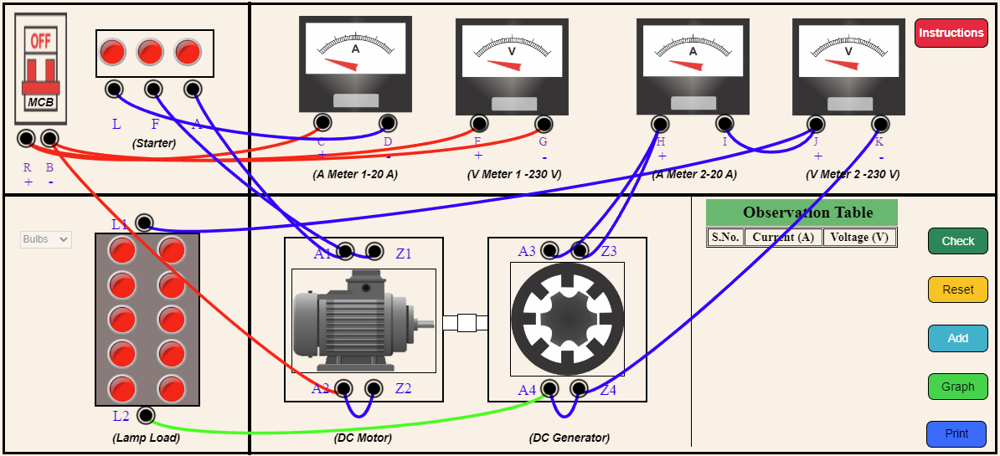

<b>STEP 1:</b> Make Connections as per the instructions given below: 

<table style="text-align:center;">
<tr>
            <td style="border:1px solid black;"><b>From</b></td>
            <td style="border:1px solid black;">R</td>
            <td style="border:1px solid black;">R</td>
            <td style="border:1px solid black;">B</td>
            <td style="border:1px solid black;">B</td>
            <td style="border:1px solid black;">A2</td>
            <td style="border:1px solid black;">L</td>
            <td style="border:1px solid black;">F</td>
            <td style="border:1px solid black;">A</td>
            <td style="border:1px solid black;">L2</td>
            <td style="border:1px solid black;">A4</td>
            <td style="border:1px solid black;">Z4</td>
            <td style="border:1px solid black;">I</td>
            <td style="border:1px solid black;">J</td>
            <td style="border:1px solid black;">H</td>
            <td style="border:1px solid black;">H</td>
</tr>
<tr>
            <td style="border:1px solid black;"><b>To</b></td>
            <td style="border:1px solid black;">C</td>
            <td style="border:1px solid black;">E</td>
            <td style="border:1px solid black;">G</td>
            <td style="border:1px solid black;">A2</td>
            <td style="border:1px solid black;">Z2</td>
            <td style="border:1px solid black;">D</td>
            <td style="border:1px solid black;">Z1</td>
            <td style="border:1px solid black;">A1</td>
            <td style="border:1px solid black;">A4</td>
            <td style="border:1px solid black;">Z4</td>
            <td style="border:1px solid black;">K</td>
            <td style="border:1px solid black;">J</td>
            <td style="border:1px solid black;">L1</td>
            <td style="border:1px solid black;">A3</td>
            <td style="border:1px solid black;">Z3</td>
</tr>
</table>
        
  
<strong>STEP 2:</strong> Click on <b>"Check"</b> Button for checking the connections.  
<strong>STEP 3:</strong> If connections is correct, MCB will be turned ON.  
<strong>STEP 4:</strong> Select the No. of Bulbs from the Lamp load.  
<strong>STEP 5:</strong> Click on <b>"Add"</b> Button to add the values to the Observation Table.  
<strong>STEP 6:</strong> Add different values to the Table by increasing the lamp load.  
<strong>STEP 7:</strong> Click on <b>"Graph"</b> Button to Create Graph.  
<strong>STEP 8:</strong> Click on <b>"Print"</b> Button to print the webpage.  
<strong>STEP 9:</strong> Click on <b>"Reset"</b> Button to reset the webpage.                
                

